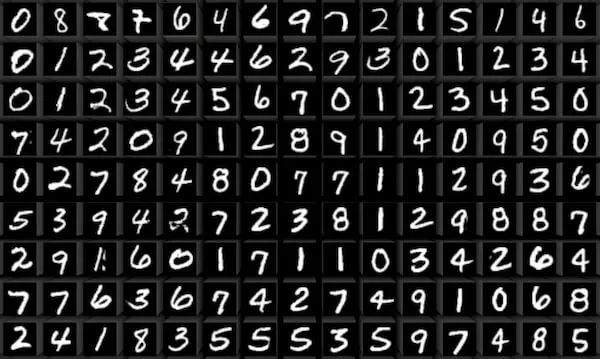
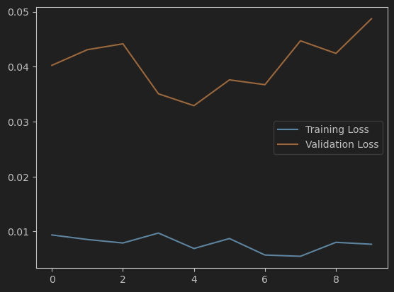
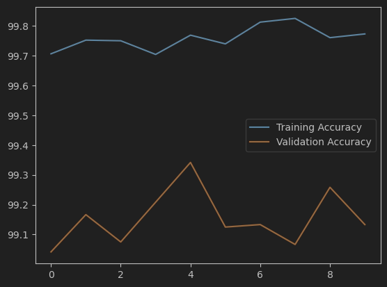
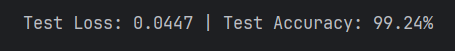

# Handwritten Digit Classifier  with Pytorch

I created a model using Convolutional Neural Network (CNN) to classifier Handwritten Digit from MNIST dataset.

Here is what the dataset looks like:

1. First, I import the MNIST dataset from the torchvision datasets, and transformed it to Tensor and normalized it so the model can learn more easily.
2. I created the model with CNN and trained it. Below the details of the training result.

3. I test the model using the Test Dataloader. It got a pretty good result.

4. I tried to adjusted the hyperparameter hoping to improve the accuracy. The accuracy actually improve by 0.04%
